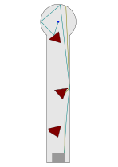

# 1 Pyramiden

| S12 Bahn   | Bahn 1 Pyramiden |
| ---------- | ---------------- |
| Ball       | ?                |
| Abschlag   | bah**N**en       |
| Par / Par+ | ?                |
| Spielweise | keine            |

## Asslinie

nächste Bahn: [2 Gradschlag Tor](02_Gradschlag_Tor.md)