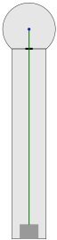

# 2 Gradschlag Tor

| Ball | Abschlag   | Stärke | Spielweise                       |
| ---- | ---------- | -------------------------------- | -------------------------------- |
| Dunkel Gelb | Mitte, leicht nach rechst (rechts denken) | schwach | Geradeaus |

[vorherige Bahn: 1 Pyramiden](01_Pyramiden.md) | [nächste Bahn: 3 Winkel](03_Winkel.md)
