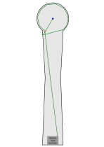

# 4 Brücke

| S12 Bahn   | S12: Bahn 6 Brücke                               |
| ---------- | ------------------------------------------------ |
| Ball       | Hart / mäßige Sprunghöhe                         |
| Abschlag   | Ganz rechts                                      |
| Par / Par+ | ?                                                |
| Spielweise | Kurz vor dem Zielkreis an die linke Brückenbande |

## Asslinie

vorherige Bahn: [3 Winkel](03_Winkel.md) | nächste Bahn: [5 Salto](05_Salto.md)
