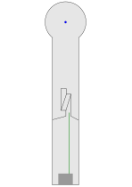

# 5 Salto

| S12 Bahn   | S12: Bahn 2 Salto   |
| ---------- | ------------------- |
| Ball       | Toter Ball          |
| Abschlag   | Mitte               |
| Par / Par+ | ?                   |
| Spielweise | Schräg in den Salto |

## Asslinie

