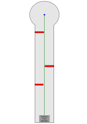

# 6 Gradschlag 2

| S12 Bahn   | S12: Bahn 10 Stäbe                              |
| ---------- | ----------------------------------------------- |
| Ball       |                                                 |
| Abschlag   | Ein bisschen links von der Mitte (Links denken) |
| Par / Par+ | ?                                               |
| Spielweise |                                                 |

## Asslinie

vorherige Bahn: [5 Salto](05_Salto.md) | nächste Bahn: [7 Schnecke](07_Schnecke.md)
