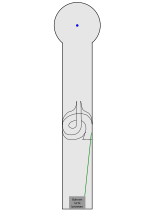

# 7 Schnecke

| Ball          | Abschlag   | Spielweise |
| ------------- | ---------- | ---------- |
| hart, langsam | Bahne**N** | tbd        |

[vorherige Bahn: 6 Gradschlag 2](06_Gradschlag_2.md) | [nächste Bahn: 8 Netz](08_Netz.md)
