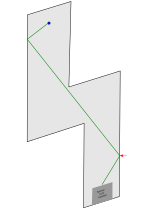

# 18 Blitz

| Ball | Abschlag  | Stärke | Spielweise                     |
| ---- | --------- | ------ | ------------------------------ |
| Rot  | bit**T**e | mittel | An erste Bande bei rotem Pfeil |

[vorherige Bahn: 17 Passagen](17_Passagen.md)
